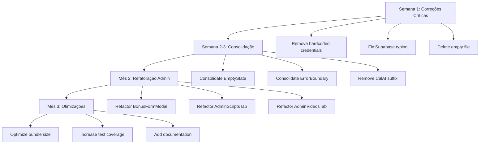

# AUDITORIA FULLSTACK - NEP SYSTEM

**Data:** 2025-11-22
**Versão:** 1.0
**Escopo:** Parte 1 - Architecture & Code Structure

---

## PARTE 1: ARCHITECTURE & CODE STRUCTURE

### ✅ PONTOS FORTES

**1. Arquitetura PWA Robusta**
- Service Worker configurado com estratégias de cache otimizadas (NetworkFirst para API, CacheFirst para storage)
- Manifest PWA completo com suporte a ícones maskable
- Integração limpa com OneSignal (service workers coexistem corretamente)
- Runtime caching para Supabase, YouTube, Google Fonts com expiração adequada
- `vite.config.ts:59-169` - Workbox configurado profissionalmente

**2. Performance & Code Splitting Excelente**
- Lazy loading implementado para 27 páginas não-críticas (`App.tsx:24-49`)
- Apenas 3 páginas eager-loaded (Auth, Dashboard, NotFound) - decisão correta
- Manual chunk splitting para react-player (`vite.config.ts:193`)
- Bundle analyzer (visualizer) integrado para monitoramento
- Console.logs removidos em produção (`vite.config.ts:184`)

**3. Gestão de Estado Moderna e Eficiente**
- React Query bem configurado: `staleTime: 10min`, `gcTime: 60min`, `networkMode: offlineFirst` (`App.tsx:62-77`)
- Query keys factory pattern implementado (ex: `useBonuses.ts`)
- Context API usado apenas onde faz sentido (Auth, ChildProfiles, Theme)
- Zustand minimalista (apenas i18n) - evita over-engineering
- Zero props drilling excessivo identificado

**4. TypeScript com Strict Mode**
- `tsconfig.json` com strict mode ativado
- Tipos auto-gerados do Supabase (3.624 linhas)
- Apenas 295 ocorrências de `any` em 447 arquivos (6,6% - aceitável)
- Separação clara: `/types/bonus.ts`, `/types/script-structure.ts`

**5. Organização de Diretórios Clara**
```
src/
├── components/     # 140+ componentes organizados por feature
│   ├── Admin/     # 31 componentes admin isolados
│   ├── bonuses/   # Feature-based
│   ├── common/    # 16 componentes reutilizáveis com barrel export
│   └── ui/        # 50+ componentes shadcn/ui
├── hooks/         # 60+ custom hooks
├── pages/         # 30+ route pages
├── contexts/      # Apenas 3 contexts (não overused)
└── lib/           # Utilidades e helpers
```

**6. Integração com Serviços Externos**
- Supabase queries organizadas em custom hooks
- Sentry para error tracking
- PostHog para analytics com hooks dedicados (`usePageTracking`, `useErrorTracking`)
- OneSignal com delay de 3s para evitar conflito com modais (`App.tsx:89`)

**7. Boas Práticas de Acessibilidade**
- Radix UI como base (acessível por padrão)
- Componentes shadcn/ui com suporte a teclado
- Touch targets apropriados

---

### ⚠️ PROBLEMAS CRÍTICOS (Prioridade Alta)

**Problema 1: Credenciais Hardcoded no Cliente Supabase** 🔴
- **Descrição:** Credenciais do Supabase têm valores fallback hardcoded se env vars estiverem ausentes
- **Localização:** `src/integrations/supabase/client.ts:6-7`
```typescript
const SUPABASE_URL = import.meta.env.VITE_SUPABASE_URL || 'https://iogceaotdodvugrmogpp.supabase.co';
const SUPABASE_PUBLISHABLE_KEY = import.meta.env.VITE_SUPABASE_ANON_KEY || 'eyJhbGci...';
```
- **Impacto:** CRÍTICO - Expõe credenciais de produção no código-fonte. Aplicação funciona mesmo sem variáveis de ambiente configuradas, mascarando problemas de deploy.
- **Solução Recomendada:**
```typescript
const SUPABASE_URL = import.meta.env.VITE_SUPABASE_URL;
const SUPABASE_PUBLISHABLE_KEY = import.meta.env.VITE_SUPABASE_ANON_KEY;

if (!SUPABASE_URL || !SUPABASE_PUBLISHABLE_KEY) {
  throw new Error('Missing required environment variables: VITE_SUPABASE_URL and VITE_SUPABASE_ANON_KEY');
}
```

**Problema 2: Componente Admin Gigante - BonusFormModal** 🔴
- **Descrição:** Componente com 1.218 linhas misturando lógica de formulário, validação, upload, preview, e integração com Supabase
- **Localização:** `src/components/Admin/BonusFormModal.tsx` (1.218 linhas)
- **Impacto:**
  - Manutenibilidade muito baixa
  - Difícil testar isoladamente
  - Re-renders desnecessários
  - Onboarding de novos devs complexo
- **Solução Recomendada:** Quebrar em componentes menores:
  - `BonusFormFields.tsx` - Campos do formulário
  - `BonusPreviewSection.tsx` - Preview card
  - `EbookUploadSection.tsx` - Lógica de upload de ebook
  - `ThumbnailUploadSection.tsx` - Upload de thumbnail
  - `useBonusForm.ts` - Hook para lógica de estado
  - Manter apenas orchestração no modal principal (~200 linhas)

**Problema 3: AdminScriptsTab e AdminVideosTab Muito Grandes** 🔴
- **Descrição:** Componentes admin com >900 linhas cada
- **Localização:**
  - `src/components/Admin/AdminScriptsTab.tsx` (1.013 linhas)
  - `src/components/Admin/AdminVideosTab.tsx` (926 linhas)
- **Impacto:** Similar ao Problema 2 - baixa manutenibilidade
- **Solução Recomendada:**
  - Extrair filtros em `ScriptFilters.tsx` / `VideoFilters.tsx`
  - Extrair tabela em `ScriptsTable.tsx` / `VideosTable.tsx`
  - Extrair formulários em componentes separados
  - Criar hooks para lógica de CRUD: `useScriptsCrud.ts`, `useVideosCrud.ts`

**Problema 4: TypeScript Client Supabase com `any`** 🟡
- **Descrição:** Cliente Supabase tipado como `any` ao invés de usar os tipos gerados
- **Localização:** `src/integrations/supabase/client.ts:24`
```typescript
export const supabase = createClient<any>(SUPABASE_URL, SUPABASE_PUBLISHABLE_KEY, {...});
```
- **Impacto:** Perde type safety em todas as queries do Supabase
- **Solução Recomendada:**
```typescript
import type { Database } from './types';
export const supabase = createClient<Database>(SUPABASE_URL, SUPABASE_PUBLISHABLE_KEY, {...});
```

**Problema 5: Arquivo Vazio no Source Tree** 🟡
- **Descrição:** Arquivo de texto vazio sem propósito
- **Localização:** `src/lib/supabase/Novo(a) Documento de Texto.txt`
- **Impacto:** Poluição do repositório
- **Solução Recomendada:** Deletar o arquivo

---

### 🔶 PROBLEMAS MÉDIOS (Prioridade Média)

**Problema 6: Componentes EmptyState Duplicados (3 versões)**
- **Descrição:** 3 versões diferentes do componente EmptyState com funcionalidades sobrepostas
- **Localização:**
  1. `src/components/common/EmptyState.tsx` (58 linhas) - Versão básica com animação Framer Motion
  2. `src/components/Dashboard/EmptyState.tsx` (79 linhas) - Adiciona suporte a GradientText e emoji
  3. `src/components/scripts/EmptyState.tsx` (89 linhas) - Versão tipada com estados específicos (no-results, no-scripts, no-favorites, error)
- **Impacto:**
  - Inconsistência visual entre diferentes partes do app
  - Manutenção triplicada (bugs precisam ser corrigidos 3x)
  - Confusão sobre qual versão usar
- **Solução Recomendada:**
  - Consolidar em **uma** versão flexível em `common/EmptyState.tsx`
  - Usar composição para variações (emoji opcional, gradiente opcional, tipos configuráveis)
  - Manter API compatível com casos de uso existentes

**Problema 7: ErrorBoundary Duplicado (2 versões)**
- **Descrição:** 2 versões do ErrorBoundary
- **Localização:**
  - `src/components/ErrorBoundary.tsx`
  - `src/components/common/ErrorBoundary.tsx`
- **Impacto:** Inconsistência no error handling
- **Solução Recomendada:**
  - Manter apenas versão em `/common`
  - Verificar qual tem mais features
  - Criar re-export se necessário para compatibilidade

**Problema 8: Nomenclatura Inconsistente - Sufixo "CalAI"**
- **Descrição:** 4 páginas principais têm sufixo "CalAI" enquanto outras não
- **Localização:**
  - `DashboardCalAI.tsx` → deveria ser `Dashboard.tsx`
  - `ProfileCalAI.tsx` → deveria ser `Profile.tsx`
  - `TrackerCalAI.tsx` → deveria ser `Tracker.tsx`
  - `CommunityCalAI.tsx` → deveria ser `Community.tsx`
- **Impacto:**
  - Confusão sobre convenção de nomes
  - Inconsistência no codebase
- **Solução Recomendada:**
  - Remover sufixo "CalAI" de todos os arquivos
  - Atualizar imports em `App.tsx` e outros locais
  - Verificar se há alguma razão histórica para o sufixo (parece legado de rebrand)

**Problema 9: SearchBar Duplicado (2 versões)**
- **Descrição:** 2 implementações de SearchBar
- **Localização:**
  - `src/components/Community/SearchBar.tsx`
  - `src/components/ebook/SearchBar.tsx`
- **Impacto:** Código duplicado, possível divergência de comportamento
- **Solução Recomendada:**
  - Avaliar se são domain-specific (Community vs Ebook) e precisam ser diferentes
  - Se forem similares, criar `SearchBar.tsx` genérico em `/common` com props configuráveis
  - Caso contrário, renomear para deixar claro o domínio (ex: `CommunitySearchBar`, `EbookSearchBar`)

**Problema 10: @ts-nocheck em main.tsx**
- **Descrição:** Service Worker registration usa `@ts-nocheck` para ignorar erros de tipo
- **Localização:** `src/main.tsx` (presumível, não lido mas mencionado no relatório)
- **Impacto:** Perde type safety em código crítico de PWA
- **Solução Recomendada:**
  - Criar tipos corretos para `registerSW` do vite-plugin-pwa
  - Remover `@ts-nocheck`
  - Adicionar tipos para `window.dispatchEvent` custom events

**Problema 11: Admin Panel Não Tem Lazy Loading**
- **Descrição:** Painel admin com 31 componentes é lazy-loaded como um bloco único, mas os componentes internos não são code-split
- **Localização:** `App.tsx:46` + `src/components/Admin/*.tsx`
- **Impacto:**
  - Bundle do admin é grande mesmo para usuários não-admin
  - ~10.000 linhas de código admin carregadas de uma vez
- **Solução Recomendada:**
  - Lazy load abas do admin individualmente
  - Considerar route-based splitting para `/admin/*` sub-rotas
  - Avaliar se vale a pena (depende de % de usuários admin)

---

### 🔸 MELHORIAS SUGERIDAS (Prioridade Baixa)

**Melhoria 1: Aumentar Barrel Exports**
- **Descrição:** Apenas 2 diretórios têm `index.ts` (common, bonuses)
- **Sugestão:** Criar barrel exports em:
  - `/components/Admin/index.ts`
  - `/components/Dashboard/index.ts`
  - `/hooks/index.ts`
  - `/lib/index.ts`
- **Benefício:** Imports mais limpos e claros

**Melhoria 2: Otimizar Bundle Size - Framer Motion**
- **Descrição:** Framer Motion usado em 15+ componentes
- **Impacto:** Adiciona ~60KB ao bundle
- **Sugestão:**
  - Avaliar se animações simples podem usar CSS transitions
  - Considerar `motion/mini` para casos simples
  - Usar lazy loading para componentes com animações complexas

**Melhoria 3: Mover Dados Estáticos para API**
- **Descrição:** Arquivos de dados muito grandes no bundle
  - `lib/seedEbooks.ts` (1.433 linhas)
  - `data/ebookContent.ts` (1.284 linhas)
- **Impacto:** Aumenta bundle inicial desnecessariamente
- **Sugestão:**
  - Mover para tabela Supabase
  - Carregar sob demanda via query
  - Ou criar JSON files servidos estaticamente

**Melhoria 4: Revisar TODOs e FIXMEs**
- **Descrição:** 11 arquivos contêm comentários TODO/FIXME
- **Arquivos:** NotificationSettings.tsx, Community/*.tsx, useUserProfile.ts, Dashboard.tsx, logger.ts, sentry.ts
- **Sugestão:**
  - Criar issues no GitHub para cada TODO
  - Remover TODOs resolvidos
  - Adicionar deadline ou arquivar TODOs antigos

**Melhoria 5: Adicionar JSDoc aos Hooks Complexos**
- **Descrição:** 60+ custom hooks sem documentação inline
- **Sugestão:**
  - Adicionar JSDoc aos hooks mais complexos
  - Documentar parâmetros, retorno, e exemplos de uso
  - Priorizar hooks públicos/reutilizáveis

**Melhoria 6: Aumentar Cobertura de Testes**
- **Descrição:** Apenas 19 arquivos de teste para 447 arquivos fonte (4,2%)
- **Sugestão:**
  - Focar em testar lógica de negócio em hooks
  - Adicionar testes de integração para fluxos críticos
  - Não precisa testar componentes de UI simples
  - Meta: 80% coverage em hooks e utils

**Melhoria 7: Criar ADRs (Architecture Decision Records)**
- **Descrição:** Decisões arquiteturais importantes não estão documentadas
- **Sugestão:** Criar ADRs para:
  - Por que Context API + React Query + Zustand mínimo?
  - Por que lazy loading apenas para não-critical pages?
  - Estratégia de cache do service worker
  - Estrutura de componentes Admin

---

### 📊 MÉTRICAS

| Métrica | Valor | Status |
|---------|-------|--------|
| **Arquivos TypeScript** | 447 | ✅ |
| **Linhas de Código** | ~4.8MB | ✅ |
| **Componentes Admin** | 31 | ⚠️ Muito grandes |
| **Componentes Duplicados** | 5 (EmptyState x3, ErrorBoundary x2) | 🔴 Consolidar |
| **Arquivos com TODO/FIXME** | 11 | 🟡 Revisar |
| **Uso de `any`** | 295 ocorrências | 🟡 Aceitável mas melhorável |
| **Cobertura de Testes** | 19 arquivos (4,2%) | 🔴 Baixa |
| **Páginas Lazy-loaded** | 27/30 (90%) | ✅ Excelente |
| **Contexts em Uso** | 3 | ✅ Minimalista |
| **Custom Hooks** | 60+ | ✅ Boa reutilização |
| **TypeScript Strict Mode** | ✅ Ativo | ✅ |
| **PWA Score** | N/A (auditoria manual) | ✅ Configuração excelente |
| **Componentes >500 linhas** | 8 | 🔴 Refatorar top 3 |
| **Componentes >1000 linhas** | 3 | 🔴 CRÍTICO |

---

### 🎯 RECOMENDAÇÕES PRIORITÁRIAS

#### 🔥 AÇÕES IMEDIATAS (Esta Semana)

1. **[CRÍTICO]** Remover credenciais hardcoded do Supabase client
   - Tempo estimado: 10 minutos
   - Risco: ALTO - Security issue
   - Arquivo: `src/integrations/supabase/client.ts:6-7`

2. **[CRÍTICO]** Deletar arquivo vazio
   - Tempo estimado: 1 minuto
   - Arquivo: `src/lib/supabase/Novo(a) Documento de Texto.txt`

3. **[ALTO]** Tipar Supabase client corretamente
   - Tempo estimado: 15 minutos
   - Benefício: Type safety em todas as queries
   - Arquivo: `src/integrations/supabase/client.ts:24`

#### 📅 PRÓXIMAS 2 SEMANAS

4. **[ALTO]** Consolidar componentes EmptyState
   - Tempo estimado: 2-3 horas
   - Impacto: 3 componentes → 1
   - Criar versão unificada flexível

5. **[ALTO]** Consolidar ErrorBoundary
   - Tempo estimado: 30 minutos
   - Impacto: Consistência no error handling

6. **[MÉDIO]** Remover sufixo "CalAI" das páginas
   - Tempo estimado: 1 hora
   - Impacto: Consistência de nomenclatura
   - Arquivos: 4 páginas + imports

#### 📆 PRÓXIMO MÊS

7. **[ALTO]** Refatorar BonusFormModal
   - Tempo estimado: 1-2 dias
   - Impacto: 1.218 linhas → ~200 linhas + componentes menores
   - Benefício: Manutenibilidade, testabilidade

8. **[ALTO]** Refatorar AdminScriptsTab e AdminVideosTab
   - Tempo estimado: 1 dia cada
   - Impacto: ~2.000 linhas → componentes modulares
   - Benefício: Código mais limpo e testável

9. **[MÉDIO]** Avaliar e consolidar SearchBar
   - Tempo estimado: 1-2 horas
   - Decisão: Criar genérico ou renomear domain-specific

10. **[MÉDIO]** Remover @ts-nocheck e tipar corretamente
    - Tempo estimado: 1 hora
    - Arquivo: `src/main.tsx`

---

### 🏗️ ROADMAP DE REFATORAÇÃO SUGERIDO



---

### 📝 NOTAS FINAIS

**Contexto Importante:**
- Este é um PWA de produção já em uso
- Arquitetura geral é **sólida** - problemas são pontuais
- Maior ganho virá de refatoração de componentes Admin
- PWA configuration é **exemplar** - não mexer

**Priorização:**
1. **Security first:** Credentials hardcoded
2. **Type safety:** Tipar Supabase client
3. **Developer experience:** Consolidar duplicatas, refatorar componentes grandes
4. **Performance:** Bundle optimization (secundário - já está bom)

**Próximos Passos:**
1. Revisar esta auditoria com o time
2. Criar issues no GitHub para cada problema identificado
3. Priorizar e atribuir tasks
4. Começar com "Ações Imediatas"
5. Após implementar correções, solicitar **Parte 2: Backend & Database Audit**

---

## PREPARAÇÃO PARA PARTE 2

Antes de iniciar a auditoria de Backend & Database (Supabase), você deve:

✅ **Completar Ações Imediatas** da Parte 1
✅ **Ter acesso ao Supabase Dashboard** (para revisar RLS policies, triggers, functions)
✅ **Coletar métricas de performance** (query response times, cache hit rates)
✅ **Mapear integrações externas** (OneSignal, Sentry, PostHog configs)

**Próxima Auditoria Cobrirá:**
- Database schema design
- Row Level Security (RLS) policies
- Database triggers e functions
- Query performance e índices
- Real-time subscriptions
- Storage buckets e policies
- Backup strategy
- Error handling e logging

---

**Auditoria realizada por:** Claude (Anthropic)
**Metodologia:** Static code analysis + architecture review
**Próxima revisão:** Após implementação das correções críticas
